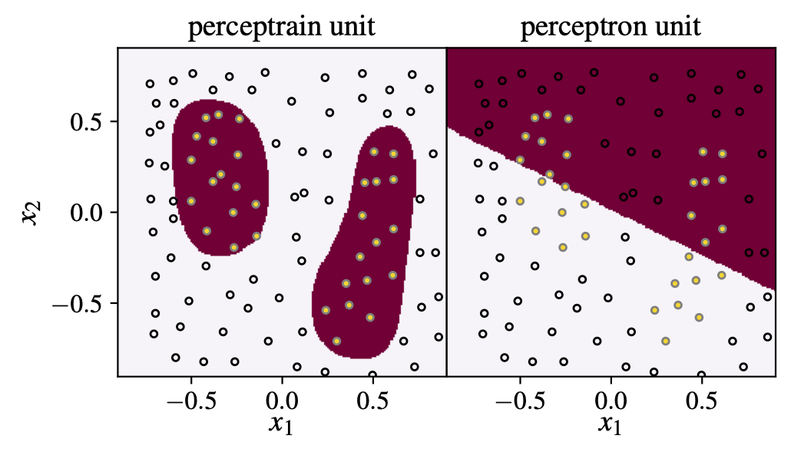
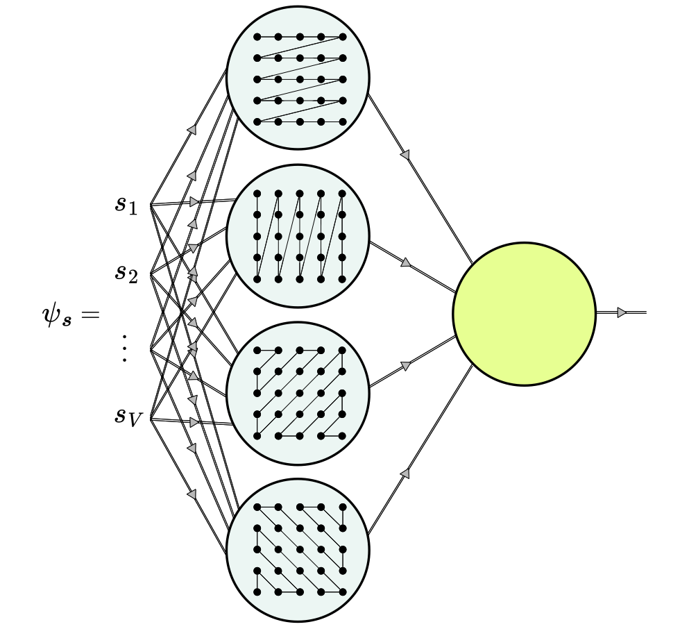
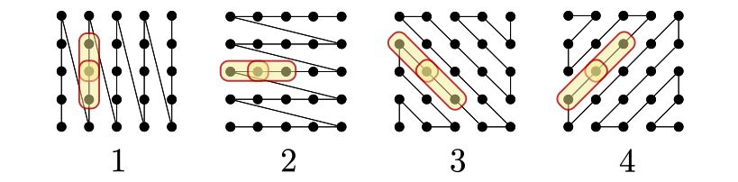

# Hybrid quantum states

We introduced a network unit that contains a tensor train - hence dubted
[Perceptrain](https://journals.aps.org/prb/abstract/10.1103/b2kz-15c5).
We describe two Perceptrains:

1. One accepts discrete inputs, which feed to the tensor network inside the
unit;
2. The other accepts continuous imputs, and expands them in terms of Chebyshev
polynomials, with coeffiecinets given by the tensor network inside.

Building a network with the units of the second tipe, is an example of nesting
polynomials, where coefficients are compressible. Because the Perceptrain
contains a polynomial, already a single unit descibes a nonlinear decision
boundary. In comparison, a single perceptron given by *f(**W** • **s** +b)* gives only a linear boundary.

In the [work](https://journals.aps.org/prb/abstract/10.1103/b2kz-15c5) we
continue by building a network of perceptrain units, taylored for the 2D 
quantum many-body problem. We use the network to represent the ground state of
the Hamiltonian of Rydberg atoms on a square lattice. The most
remarcable result, is that we obtain 5 digit precision with a very small number
of parameters. In comparable methods, we are talking of at least a factor 10 000
more parameters.

In the work that is now on the way, we also show that the accuracy does not
significantly decrese with the system size. We have reached the same precision
also on 20x20 lattices, and in a larger spectrum of models. 

## Replicas

The incredible performance of the network in 2D model is due to the generalisation
of the tensor network introduced in the ansatz. Instead of projecting a 2D system 
onto a 1D chain, as is done in a tensor train, we use more trains with different
projections, so that different units can encode different correaltions.

By constraining the size of the tensors, each unit is forced to encode only
short range correlations.

