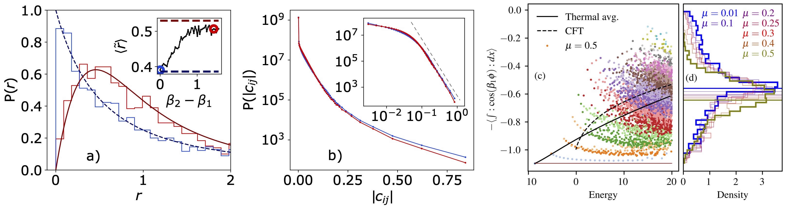

# Quantum chaos

The physics of non-integrable quantum systems is believed to be described by the theory of [quantum chaos](https://iopscience.iop.org/article/10.1088/0305-4470/10/12/016), which predicts that their statistical properties are indistinguishable from those of randomly generated matrices with the same symmetries. If one prepares a closed chaotic quantum system in an excited state and evolves it in time, then, in analogy with classical chaotic systems, one would expect it to reach thermal equilibrium and be described by statistical mechanics. However, due to unitary dynamics, after a long time, the [state retains all the information about the initial state in its coefficients](https://www.tandfonline.com/doi/full/10.1080/00018732.2016.1198134). The solution, formalized by the Eigenstate Thermalization Hypothesis ([ETH](https://journals.aps.org/pra/abstract/10.1103/PhysRevA.43.2046)), is that instead one should look at the expectation values of local observables in the energy eigenstates. If these values remain sufficiently constant in a sufficiently large energy window, then the long-time average will tend to the average over the energy window. This is directly analogous to the definition of ergodicity in classical systems.

Quantum chaos and ergodicity conjectures have been extensively tested in single- and many-body quantum systems. However, quantum field theories, the fundamental theories of nature, live in a continuous and infinite Fock space. This makes them notoriously difficult and renders the statistical properties of the high-energy spectrum mostly inaccessible. A main exception are some exactly solvable Conformal Field Theories (CFT). However, in recent years it was realized that eigenstates of relevant perturbations of exactly solvable models can be efficiently treated using [Hamiltonian truncation](https://www.worldscientific.com/doi/abs/10.1142/S0217751X91002161). In this approach, the Hamiltonian is expressed in the exactly solvable CFT basis. Because the perturbation is relevant in the renormalization group sense, the underlying CFT describes the high-energy spectrum, allowing for efficient truncation of the basis in energy.

In a project started during my Master's thesis, we used this approach to study (1+1)D non-integrable models of quantum field theory. We studied the integrable sine-Gordon model (SG), perturbed by another cosine term (DSG), or by a mass term (MSG), and the φ^4 model. The SG, DSG, and MSG models were expressed in the free boson basis using code developed by [I. Kukuljan](https://journals.aps.org/prl/abstract/10.1103/PhysRevLett.121.110402). The φ^4 model was alternatively expressed in the basis of the Klein-Gordon model.

We [studied the DSG model](doi.org/10.1103/PhysRevLett.132.021601) in a regime where integrability was strongly broken by the second cosine term, as evidenced by spectral statistics.

However, it was not clear if ETH is also obeyed due to an anomaly. The [statistics of eigenvectors stays almost indistinguishable](doi.org/10.1103/PhysRevLett.126.121602) between integrable SG and non-integrable DSG, while the theory of quantum chaos predicts otherwise. The same behavior was also observed in MSG and φ^4. We therefore looked at the expectation value of observables, as stated by ETH. We found a family of one-quasiparticle states that had very low entanglement and expectation values of observables far from thermal averages. In lattice systems, such states appear at low energies and disappear at higher energies due to unstable quasiparticles. However, we argue that due to Lorentz invariance, these states exist at all energies. This is because states at different energies are the ground states in their proper inertial frame. If their measure vanishes in the thermodynamic limit, a so-called weak version of ETH can still hold. However, at finite system sizes, ETH is violated, breaking the so-called strong ETH. As shown in Figures (c) and (d), by increasing the system size, the density of states does not vanish in the region between the thermal average and the special states. Instead, the density narrows around the thermal average but remains system-size independent near the special states. This suggests that these states might affect averages even in the thermodynamic limit and therefore violate even weak ETH.

